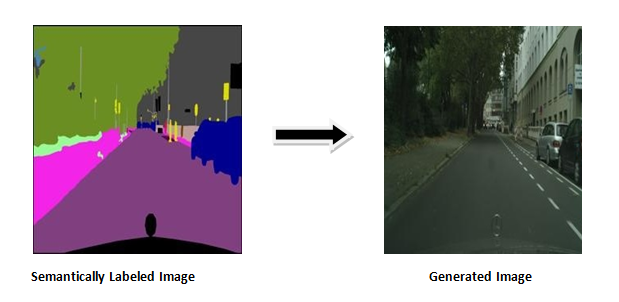
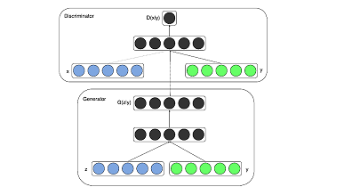
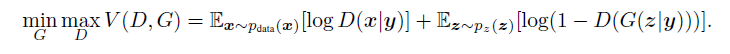

#Image to Image Translation with Conditional GANs.

In this part of the repository I implement [Conditional GAN](https://arxiv.org/pdf/1411.1784.pdf) for Image to Image Translation based on [this](https://arxiv.org/pdf/1611.07004.pdf) paper.
The model is trained on the [cityscapes](https://www.kaggle.com/vikramtiwari/pix2pix-dataset#cityscapes.tar.gz) dataset.

I will translate semantic labels back to its original form .

## Conditional GAN

The GAN architecture can be modified to include additional inputs, y, on which the models can be conditioned. y can be any type of additional inputs, for example, class labels. The conditioning can be achieved by simply feeding y to both the Generator — G(z|y) and the Discriminator — D(x|y).*These networks not only learn the mapping from the input image to the output image, but also learn a loss function to train this mapping*.

In our case y will be the semantically labeled photos .

The objective function of the two player minimax game changes to:-

A defining feature of image-to-image translation problems
is that they map a high resolution input grid to a high resolution
output grid. In addition, for the problems we consider,
the input and output differ in surface appearance, but both
are renderings of the same underlying structure. Therefore,
structure in the input is roughly aligned with structure in the
output. We design the **generator architecture** around these
considerations and use skip-connections and thus a [U-net](https://arxiv.org/pdf/1505.04597.pdf) based architecture as proposed in the paper.

For the **discriminator** I have used a
convolutional [PatchGAN](https://www.researchgate.net/figure/Architecture-of-the-PatchGAN-Discriminator-network_fig5_328150573) classifier, which only penalizes
structure at the scale of image patches.This
discriminator tries to classify if each N X N patch in an
image is real or fake.This discriminator is run convolutationally
across the image, averaging all responses to provide
the ultimate output of D.
